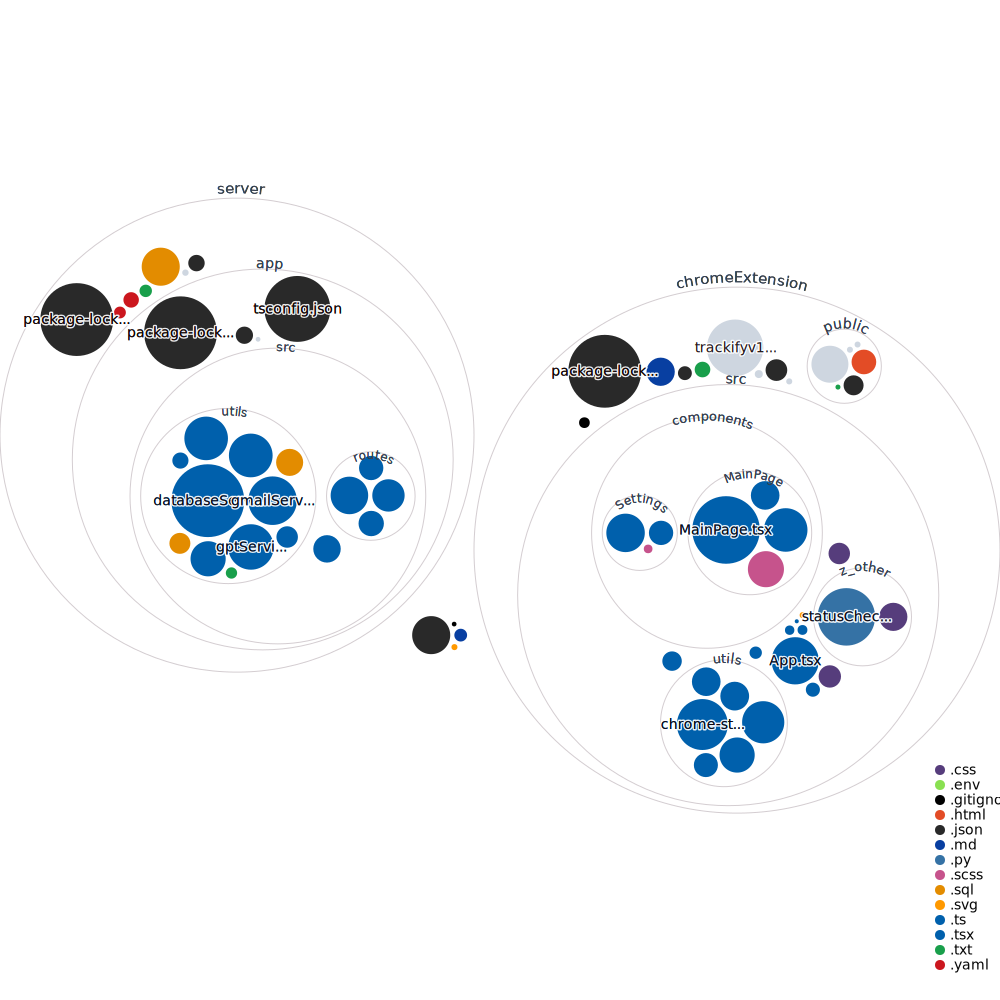

# Trackify
A job application tracking platform.
We use GPT to determine the status of your application from the email that you recieve.
The content of your email is not saved anywhere in the application, just used to generate a status: 
"applied", "interview", "offer", "rejected", "ghosted". 

